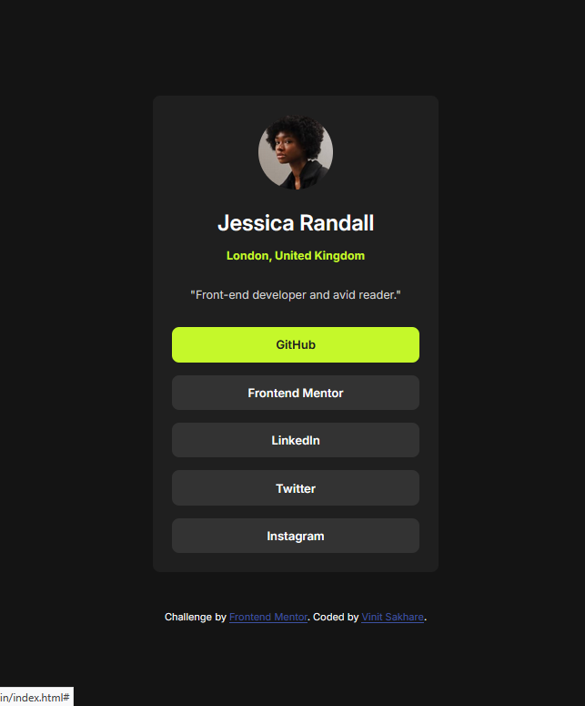

# Frontend Mentor - Social links profile solution

This is a solution to the [Social links profile challenge on Frontend Mentor](https://www.frontendmentor.io/challenges/social-links-profile-UG32l9m6dQ). Frontend Mentor challenges help you improve your coding skills by building realistic projects. 

## Table of contents

- [Overview](#overview)
  - [The challenge](#the-challenge)
  - [Screenshot](#screenshot)
  - [Links](#links)
- [My process](#my-process)
  - [Built with](#built-with)
  - [What I learned](#what-i-learned)
  - [Useful resources](#useful-resources)
- [Author](#author)

## Overview

### The challenge

Users should be able to:

- See hover and focus states for all interactive elements on the page

### Screenshot

### Links

- [See Solution](https://www.frontendmentor.io/solutions/responsive-social-links-profile-using-flex---mobile-first-approach-MOV3MwY-mO)
- [See Live Site](https://vinit1234.github.io/FrontEndMentorProjects/3-social-links-profile-main/index.html)

## My process

### Built with

- Semantic HTML5 markup
- CSS custom properties
- Flexbox
- Mobile-first workflow

### What I learned

- Use of flex can be optimised. Use it only where necessary.

- Organising CSS in sections.
- `<nav>` can be inside `<main>` if it is specific to `<main>` section only.
- Apply hovering effect on `<a>` rather than `<li>` in navigation.

### Useful resources

- [Nav can be inside main](https://stackoverflow.com/questions/22549766/should-a-nav-tag-be-outside-the-main-tag) - This helped me for understanding that navigation ( which is specific to main tag ) can be put within main itself.
- [Navigation hover changes nav-link color](https://codepen.io/maheshambure21/pen/QwXaRw) - This is an amazing article which helped me finally understand to add hover effects on `<a>` tag instead of `<link>` tag.

## Author

- Frontend Mentor - [@Vinit1234](https://www.frontendmentor.io/profile/Vinit1234)
- Twitter - [@SakhareVin23504
](https://x.com/SakhareVin23504)

