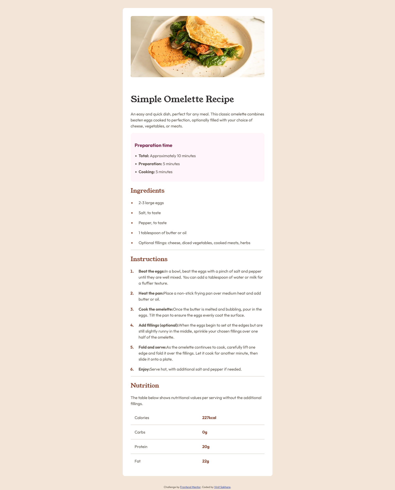

# Frontend Mentor - Recipe page solution

This is a solution to the [Recipe page challenge on Frontend Mentor](https://www.frontendmentor.io/challenges/recipe-page-KiTsR8QQKm). Frontend Mentor challenges help you improve your coding skills by building realistic projects. 

## Table of contents

- [Overview](#overview)
  - [The challenge](#the-challenge)
  - [Screenshot](#screenshot)
  - [Links](#links)
- [My process](#my-process)
  - [Built with](#built-with)
  - [What I learned](#what-i-learned)
  - [Useful resources](#useful-resources)
- [Author](#author)

**Note: Delete this note and update the table of contents based on what sections you keep.**

## Overview

### Screenshot




### Links

- Solution URL: [Add solution URL here](https://your-solution-url.com)
- Live Site URL: [Add live site URL here](https://your-live-site-url.com)

## My process

### Built with

- Semantic HTML5 markup
- CSS custom properties
- Flexbox
- Mobile-first workflow

### What I learned

- If web page is meant for single content( Eg. selected blog post ), use `<article>` as parent and divide it into multiple `<section>`(s).

  If the web page is meant to display multiple contents (Eg. cards of blog posts), then use `<section>` as parent and divide it into multiple `<article>`(s).

In the W3 wiki page about structuring HTML5, it says:

    `<section>`: Used to either group different articles into different purposes or subjects, or to define the different sections of a single article.

If `<section id="main">` contains blog entries. Each blog entry would be suitable for syndicating as an item in an RSS feed, and would make sense when read on its own, out of context, therefore `<article>` is perfect for them:
```
<section id="main">
    <article>
      <!-- first blog post -->
    </article>

    <article>
      <!-- second blog post  -->
    </article>

    <article>
      <!-- third blog post -->
    </article>
</section>
```

Also if the page has single content it can be broken as:

```
<article>
  <section id="introduction">
  </section>

  <section id="content">
  </section>

  <section id="summary">
  </section>
</article>
```

- Use `li>::marker` to give color to bullets of `<list>`

- `<article>` must have heading

- Heading levels should only increase by one

`<h4>Preparation time</h4>`


### Useful resources

- [Difference between Section vs Article elements in HTML](https://stackoverflow.com/questions/7549561/difference-between-section-vs-article-elements-in-html) - This helped me to understand differences and interdependecies of `<section>` and `<article>`.

- [CSS Typography](https://www.webfx.com/blog/web-design/css-typography-01/) - This is an amazing article which helped me finally understand the scope of typography and its concepts.

- [Colored Bullets in List w/o affecting content](https://css-tricks.com/finally-it-will-be-easy-to-change-the-color-of-list-bullets/)


## Author

- Website - [Add your name here](https://www.your-site.com)
- Frontend Mentor - [@Vinit1234](https://www.frontendmentor.io/profile/Vinit1234)
- Twitter - [@SakhareVin23504
](https://x.com/SakhareVin23504)


