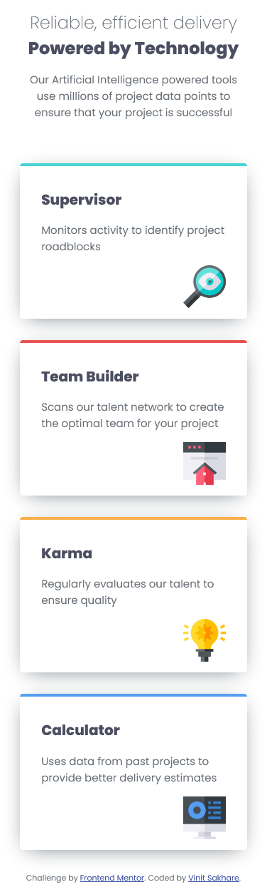
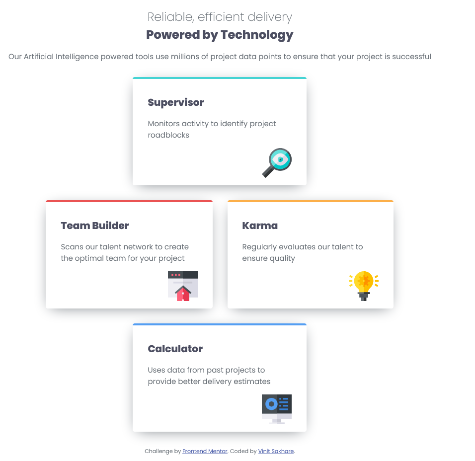
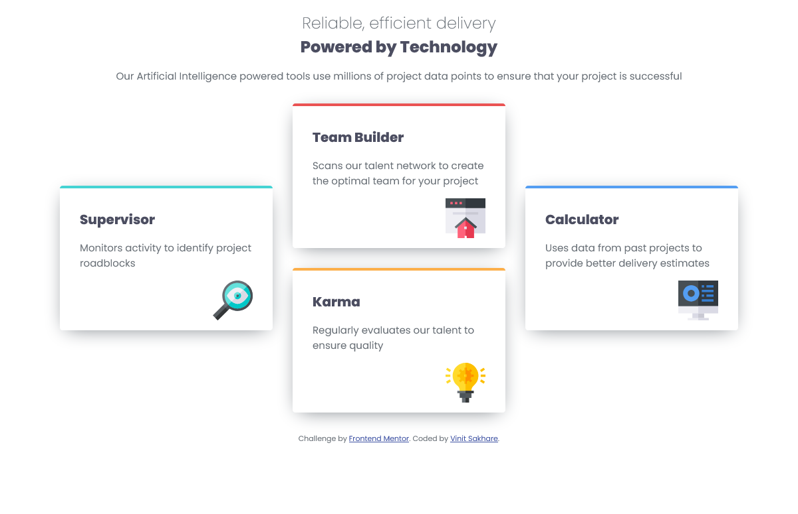

# Frontend Mentor - Four card feature section solution

This is a solution to the [Four card feature section challenge on Frontend Mentor](https://www.frontendmentor.io/challenges/four-card-feature-section-weK1eFYK). Frontend Mentor challenges help you improve your coding skills by building realistic projects. 

## Table of contents

- [Overview](#overview)
  - [The challenge](#the-challenge)
  - [Screenshot](#screenshot)
  - [Links](#links)
- [My process](#my-process)
  - [Built with](#built-with)
  - [What I learned](#what-i-learned)
  - [Continued development](#continued-development)
- [Author](#author)

**Note: Delete this note and update the table of contents based on what sections you keep.**

## Overview

### The challenge

Users should be able to:

- View the optimal layout for the site depending on their device's screen size

### Screenshot

### Links

- [Solution URL here](https://github.com/Vinit1234/FrontEndMentorProjects/tree/develop/6-four-card-feature-section)
- [Live site URL here](https://vinit1234.github.io/FrontEndMentorProjects/6-four-card-feature-section/index.html)

## My process

### Built with

- Semantic HTML5 markup
- CSS custom properties
- Flexbox
- CSS Grid
- Mobile-first workflow

### What I learned

With this project, I got hands-on learning on how to apply flex and grid to make responsive layouts for different screen sizes.

### Continued development

I would work on more such projects to improve my judgements on utilizing grids and flexbox in complex layouts.

## Author

- Frontend Mentor - [@Vinit1234](https://www.frontendmentor.io/profile/Vinit1234)
- Twitter( X.com ) - [@SakhareVin23504
](https://x.com/SakhareVin23504)

