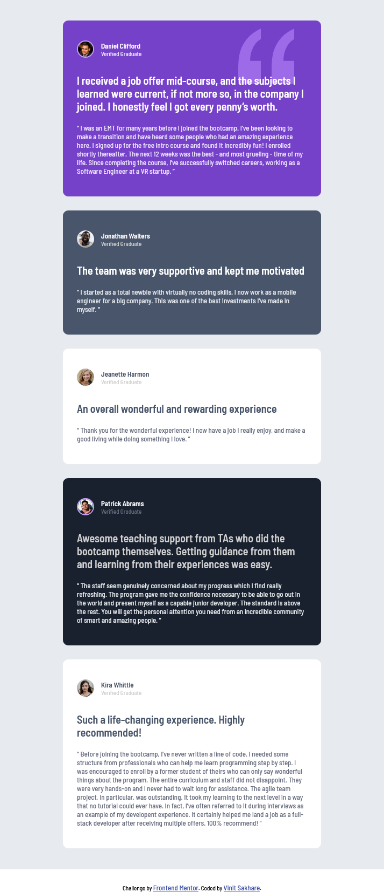
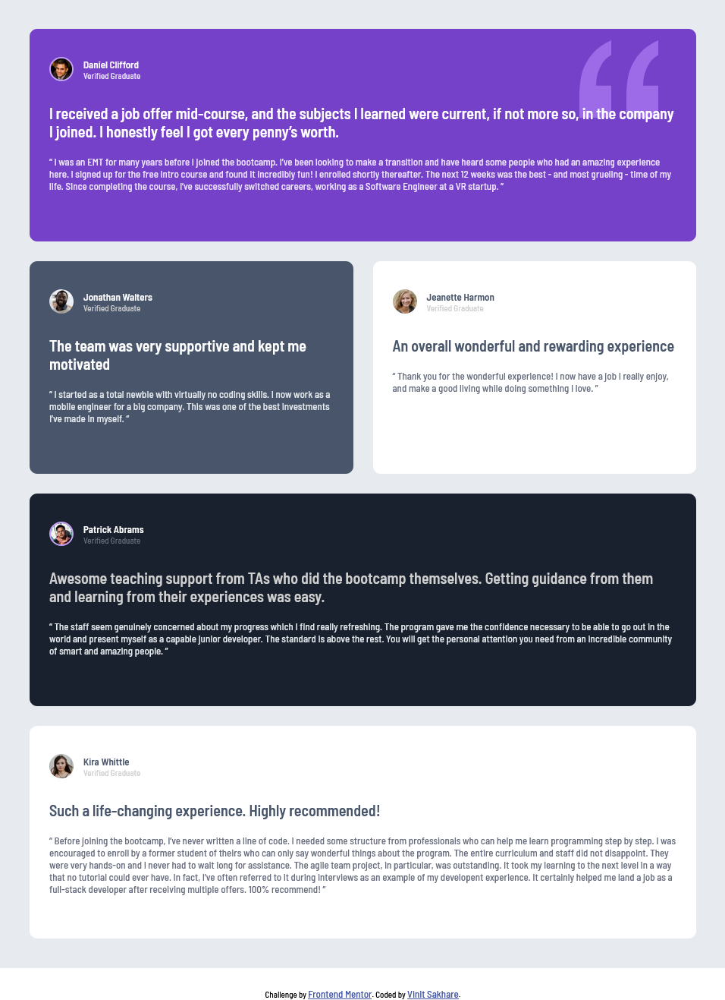
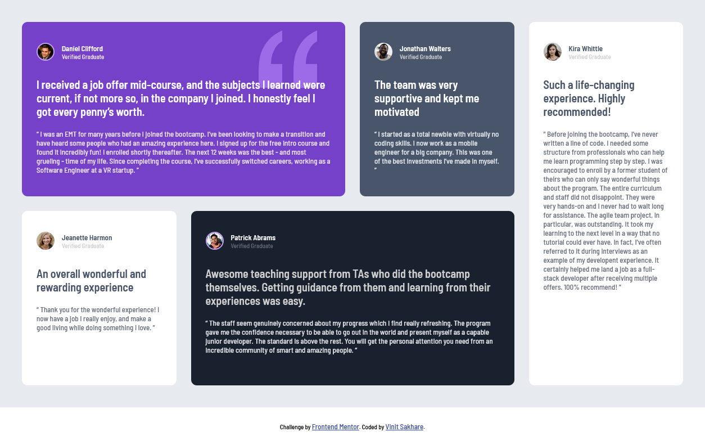

# Frontend Mentor - Testimonials grid section solution

This is a solution to the [Testimonials grid section challenge on Frontend Mentor](https://www.frontendmentor.io/challenges/testimonials-grid-section-Nnw6J7Un7). Frontend Mentor challenges help you improve your coding skills by building realistic projects. 

## Table of contents

- [Overview](#overview)
  - [The challenge](#the-challenge)
  - [Screenshot](#screenshot)
  - [Links](#links)
- [My process](#my-process)
  - [Built with](#built-with)
  - [What I learned](#what-i-learned)
- [Author](#author)

**Note: Delete this note and update the table of contents based on what sections you keep.**

## Overview

### The challenge

Users should be able to:

- View the optimal layout for the site depending on their device's screen size

### Screenshot

### Links

- [Solution URL](https://github.com/Vinit1234/FrontEndMentorProjects/tree/develop/7-testimonials-grid-section)
- [Live Site URL](https://vinit1234.github.io/FrontEndMentorProjects/7-testimonials-grid-section/index.html)

## My process

### Built with

- Semantic HTML5 markup
- CSS custom properties
- Flexbox
- CSS Grid
- Mobile-first workflow
- SASS
- Parcel

### What I learned

With this project, I gained in-depth knowledge on implementation of complex responsive layouts using flex, grid and their properties along with media queries.

I also got an opportunity to implement mixins in SASS using Parcel.

The task of adding a quote image in background using position property added an addition challenge and it was fun.

### Continued development

I will learn more about SASS project structure to achieve modularity using partials and other concepts. 

## Author

- Frontend Mentor - [@Vinit1234](https://www.frontendmentor.io/profile/Vinit1234)
- Twitter( X.com ) - [@SakhareVin23504
](https://x.com/SakhareVin23504)

