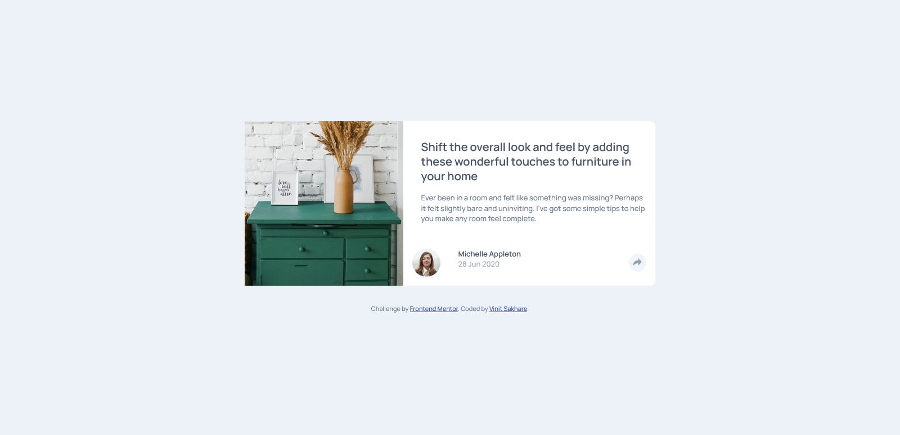
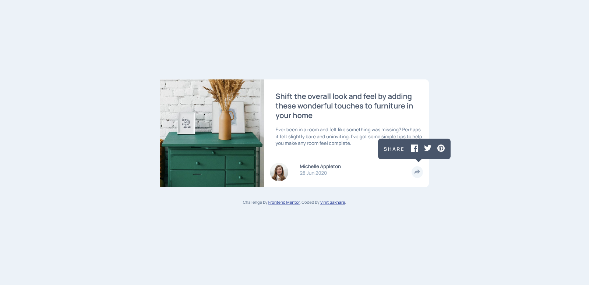
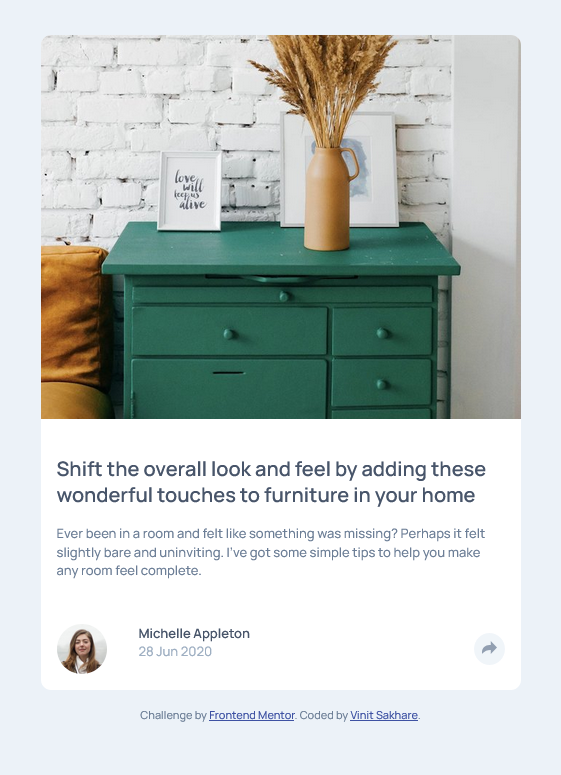
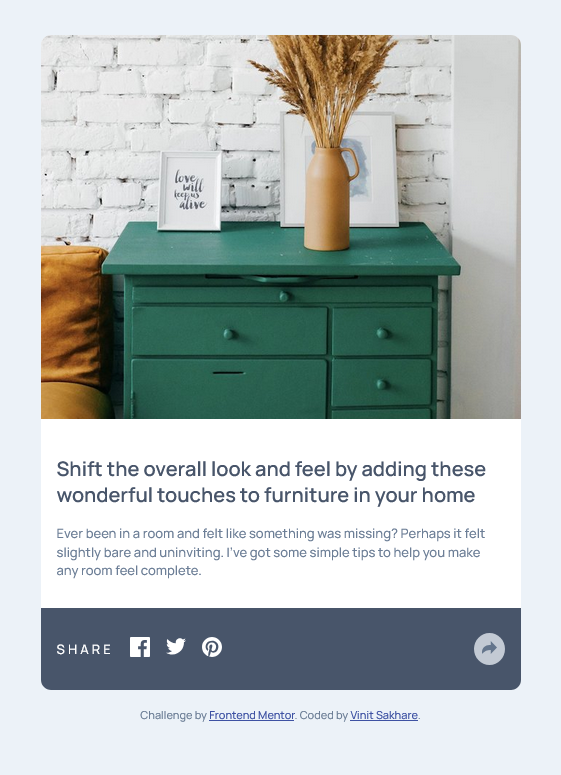

# Frontend Mentor - Article preview component solution

This is a solution to the [Article preview component challenge on Frontend Mentor](https://www.frontendmentor.io/challenges/article-preview-component-dYBN_pYFT). Frontend Mentor challenges help you improve your coding skills by building realistic projects. 

## Table of contents

- [Overview](#overview)
  - [The challenge](#the-challenge)
  - [Screenshot](#screenshot)
  - [Links](#links)
- [My process](#my-process)
  - [Built with](#built-with)
  - [What I learned](#what-i-learned)
- [Author](#author)

**Note: Delete this note and update the table of contents based on what sections you keep.**

## Overview

### The challenge

Users should be able to:

- View the optimal layout for the component depending on their device's screen size
- See the social media share links when they click the share icon

### Screenshot

### Links

- Solution URL: [Add solution URL here](https://your-solution-url.com)
- Live Site URL: [Add live site URL here](https://your-live-site-url.com)

## My process

### Built with

- Semantic HTML5 markup
- CSS custom properties
- Flexbox
- Mobile-first workflow
- SASS
- Parcel
- Vanilla JS

### What I learned

- This project was a jumpstart exercise to perform DOM manipulation and handle events.

- It provided a great hands on learning on how to change CSS and reuse components. Also, how DOM gets affected on replacing the elements. 

- How to plan separation of the group of elements for different screens based on resusing components or considering their active states beforehand.

## Author

- Frontend Mentor - [@Vinit1234](https://www.frontendmentor.io/profile/Vinit1234)
- Twitter( X.com ) - [@SakhareVin23504
](https://x.com/SakhareVin23504)

