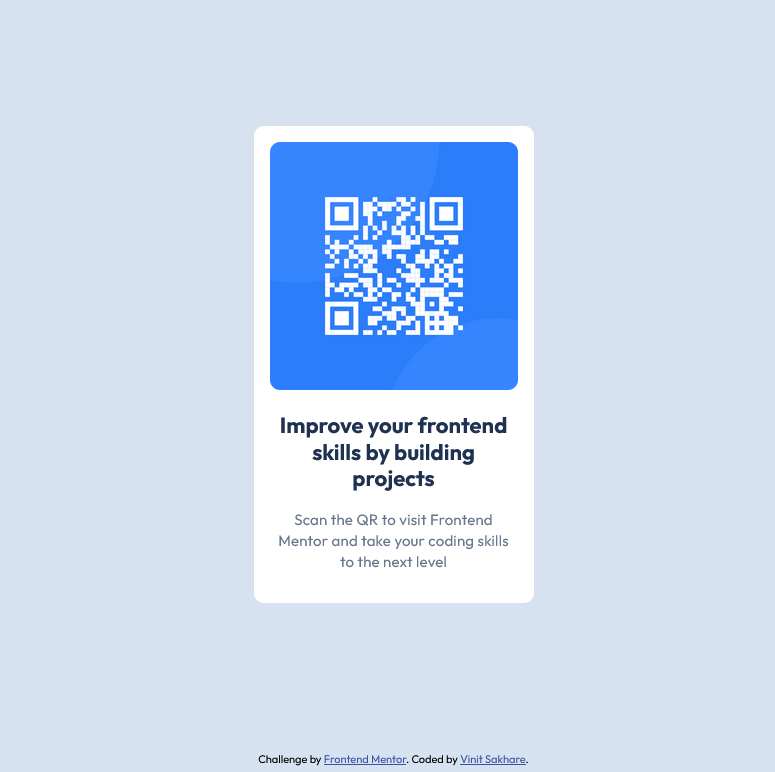

# Frontend Mentor - QR code component solution

This is a solution to the [QR code component challenge on Frontend Mentor](https://www.frontendmentor.io/challenges/qr-code-component-iux_sIO_H). Frontend Mentor challenges help you improve your coding skills by building realistic projects. 

## Table of contents

- [Overview](#overview)
  - [Screenshot](#screenshot)
  - [Links](#links)
- [My process](#my-process)
  - [Built with](#built-with)
  - [What I learned](#what-i-learned)
  - [Continued development](#continued-development)
  - [Useful resources](#useful-resources)
- [Author](#author)
- [Acknowledgments](#acknowledgments)

## Overview

### Screenshot

### Links

- Solution URL: [Add solution URL here](https://your-solution-url.com)
- Live Site URL: [Live QR Code Component](https://vinit1234.github.io/FrontEndMentorProjects/qr-code-component-main/index.html)

## My process

### Built with

- Semantic HTML5 markup
- CSS custom properties
- Flexbox
- Mobile-first workflow

### What I learned

- Basic concepts of HTML Semantics, Flexbox and Media Queries.
- Refering to Figma Design
- Setting up Git and GitHub repositories
- Writing markdown for README.md files
- Deploying project on Github Pages

## HTML report - errors/warnings resolved

- Consider using the "h1" element as a top-level heading only (all "h1" elements are treated as top-level headings by many screen readers and other tools).

- Section lacks heading. Consider using "h2"-"h6" elements to add identifying headings to all sections.

### Continued development

Need more hands on practice on Flexbox implementation

## Author

- Website - [Add your name here](https://www.your-site.com)
- Frontend Mentor - [@Vinit1234](https://www.frontendmentor.io/profile/Vinit1234)

